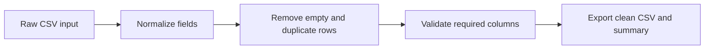

# CSV Data Cleaner & Validator
[](https://github.com/farshidghaffari/csv-data-cleaner-validator/actions/workflows/tests.yml)

**Supporting implementation · Data quality and preprocessing · Python / Pandas**

A reusable preprocessing workflow for normalizing CSV files, removing exact duplicates and empty rows, checking the required schema, reporting unresolved missing values, and exporting a clean dataset for downstream use.

## Business Problem

CSV files exported from spreadsheets, CRMs, e-commerce platforms, and internal tools often reach the next system in an inconsistent state. Column names may not match the expected schema, text can contain hidden whitespace, duplicate records can distort totals, and required fields may be absent entirely.

If those issues are passed directly into a report, dashboard, CRM import, or automation, the failure often appears later and is harder to diagnose. This implementation places an explicit data-quality step at the boundary of the workflow.

## Implemented Workflow



The current implementation:

- Confirms that the source file exists
- Normalizes column names to lowercase underscore format
- Trims surrounding whitespace from text values
- Converts blank text values into explicit missing values
- Removes fully empty rows
- Detects and removes exact duplicate rows
- Verifies that configured required columns exist
- Counts unresolved missing values by column
- Preserves the source file and writes a separate cleaned output
- Returns a structured processing summary for logging or later integration

## Validation Summary

The processing function returns:

| Field | Meaning |
|---|---|
| `input_file` | Source file path |
| `output_file` | Cleaned file path |
| `original_rows` | Row count before cleaning |
| `rows_after_empty_drop` | Row count after removing fully empty rows |
| `duplicate_rows_removed` | Number of exact duplicates removed |
| `final_rows` | Row count in the exported file |
| `columns` | Normalized output columns |
| `missing_values` | Remaining missing-value count by affected column |

Running the included demonstration against `sample_data/messy_customers.csv` produces this verified summary:

```text
Original rows:             9
Rows after empty removal:  8
Exact duplicates removed:  1
Final rows:                7
Remaining missing values:  email=1, country=1
```

The missing values remain visible in the summary rather than being silently invented or replaced.

## Required Columns

The demonstration expects:

```text
customer_id, name, email, country, signup_date
```

Required field names are normalized before comparison. For example, `Customer ID`, `customer-id`, and `customer_id` are evaluated against the same normalized name.

If a required column is absent, processing stops with a clear `ValueError` and no cleaned dataset is presented as complete.

## Quick Start

### 1. Clone the repository

```bash
git clone https://github.com/farshidghaffari/csv-data-cleaner-validator.git
cd csv-data-cleaner-validator
```

### 2. Create and activate a virtual environment

```bash
python -m venv .venv
```

Windows:

```bash
.venv\Scripts\activate
```

macOS / Linux:

```bash
source .venv/bin/activate
```

### 3. Install dependencies

```bash
pip install -r requirements.txt
```

### 4. Run the demonstration

```bash
python examples/run_demo.py
```

The cleaned file will be written to:

```text
output/clean_customers.csv
```

## Testing

Run the automated tests with:

```bash
pytest -q
```

The current test suite verifies:

- Column-name normalization
- Cleaned-file creation
- Empty-row removal and exact deduplication
- Rejection of files with missing required columns

## Reliability Decisions

- **Normalize at the boundary.** Downstream logic receives predictable field names.
- **Do not modify the source file.** A separate output preserves the original input for traceability.
- **Fail on missing schema.** Absent required columns stop the workflow instead of creating a misleading export.
- **Report unresolved gaps.** Missing cell values are counted and returned to the caller.
- **Keep cleaning deterministic.** The same input and configuration produce the same output and summary.

## Current Boundaries

This is a focused supporting implementation, not a complete data-quality platform.

- Required-column validation checks schema presence, not whether every required cell contains a value.
- Duplicate detection currently removes exact row matches; it does not perform fuzzy matching or identity resolution.
- Email addresses, dates, identifiers, and country values are not semantically validated.
- Encoding and delimiter selection use the Pandas defaults.
- Rejected or questionable records are summarized but are not yet exported to a separate review file.
- The workflow runs locally and does not yet include scheduling, notifications, or an integration API.

These boundaries are explicit so implemented behavior remains distinguishable from future extensions.

## Adaptation Paths

This preprocessing pattern can be extended for:

- CRM import preparation
- Sales-lead validation
- Customer and supplier data cleanup
- E-commerce order exports
- Reporting and dashboard input
- File-based system integrations
- Scheduled data-quality checks

## Repository Structure

```text
csv-data-cleaner-validator/
├── docs/
│   └── project-overview.md
├── examples/
│   └── run_demo.py
├── sample_data/
│   └── messy_customers.csv
├── src/csv_cleaner_validator/
│   ├── __init__.py
│   └── cleaner.py
├── tests/
│   └── test_cleaner.py
├── requirements.txt
└── README.md
```

## Related Links

- [Portfolio projects](https://farshidghaffari.net/projects/)
- [Why clean data before integration](https://farshidghaffari.net/insights/clean-data-before-integration/)
- [Discuss a data workflow](https://farshidghaffari.net/contact/)

## Author

**Farshid Ghaffari**  
Business Automation & Integration Specialist  
AI Workflows · APIs · Backend Systems

